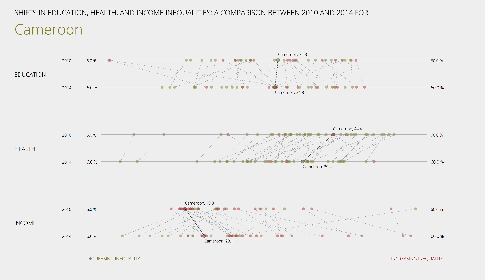

 ## Changes in Health, Education, and Income Inequality in Sub-Saharan Africa
 
 ### Preview

 
 
 ### Abstract
 
 This visualization investigates the ways in which education inequality, health inequality, and income inequality changed from 2010 to 2014 in the different countries of Sub-Saharan Africa.
 The numerical value for each inequality is the Atkinson Measure as reported by the UNDP in the 2015 Human Development Report [1]. The Atkinson Measure is a measure of inequality that varies between 0 and 1 -- or 0% and 100%, equivalently  -- with 0 indicating no inequality and 1 indicating complete inequality.
 The visualization is a synthesized re-rendering of three charts found in Chapter 11 of Income Inequality Trends in Sub-Saharan Africa [2], which plot the same data. 
 The intended goal is to emphasize and clarify the connection between these three charts, providing a user-friendly way of tracking both the absolute and relative change undergone by each individual country betwen 2010 and 2014 in all three areas of inequality.
 
 ### Instructions
 
 There are six axes of inequality, each with the same scale ranging from 6% to 60%. These six axes are broken into three groups of two, an axis for each year for each of the three types of inequality.
 Each country is represented by a yellow dot, and the change for a single country between 2010 and 2014 is shown by the dashed line that connects the two dots that refer to that country, each in a different year.
 Longer dashed lines, therefore, imply greater changes; movements to the left imply positive changes (a decrease in inequality); and movements to the right imply negative changes (an increase in inequality). 
 
 Hovering over a point highlights all the data for that country across the chart and adjusts the title to include that country's name, which focalizes the chart on that country and allows for comparison between types of inequality.
 Clicking on a point, furthermore, yields an editorial statement that interprets and synthesizes the immediate information for that point. 
 Finally, hovering over the labels for any of the types of inequality reveals information about the basis on which the corresponding numerical figures are generated. 
 
 ### Sources
 
 [1] Jahan, Selim. Human Development Report 2015. Report. United Nations Development Programme. New York, NY: United Nations Development Programme, 2015. 1-288. http://hdr.undp.org/sites/default/files/2015_human_development_report.pdf.
 
 [2] Odusola, Ayodele F., Giovanni Andrea Cornia, Haroon Bhorat, and Pedro Conceição. Income inequality trends in sub-Saharan Africa: divergence, determinants and consequences: overview. New York, NY: United Nations Development Programme, Regional Bureau for Africa, 2017.

 [3] United Nations Development Programme. Advertisement. Human Development Data. http://hdr.undp.org/en/data. Inequality in Life Expectancy(%), Inequality in Education(%), Inequality in Income(%)